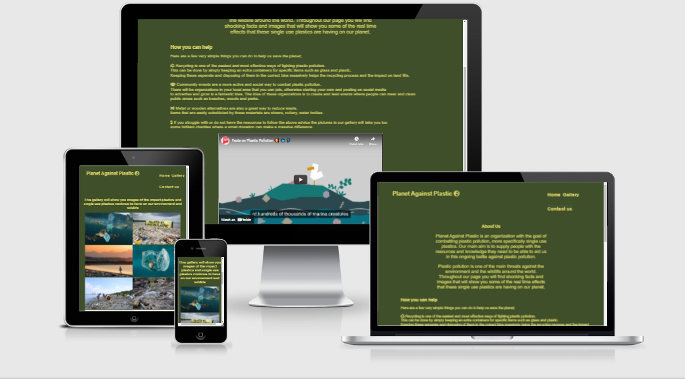
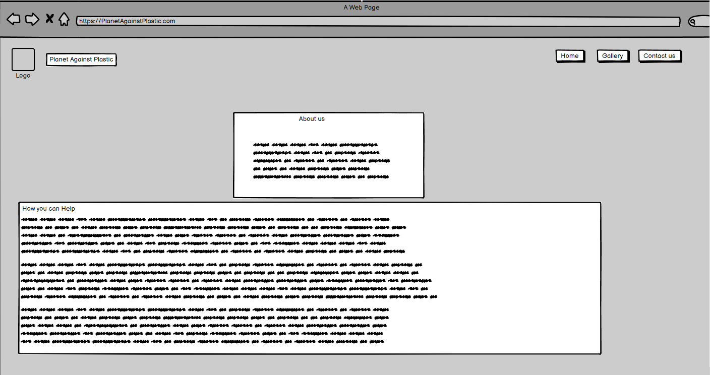
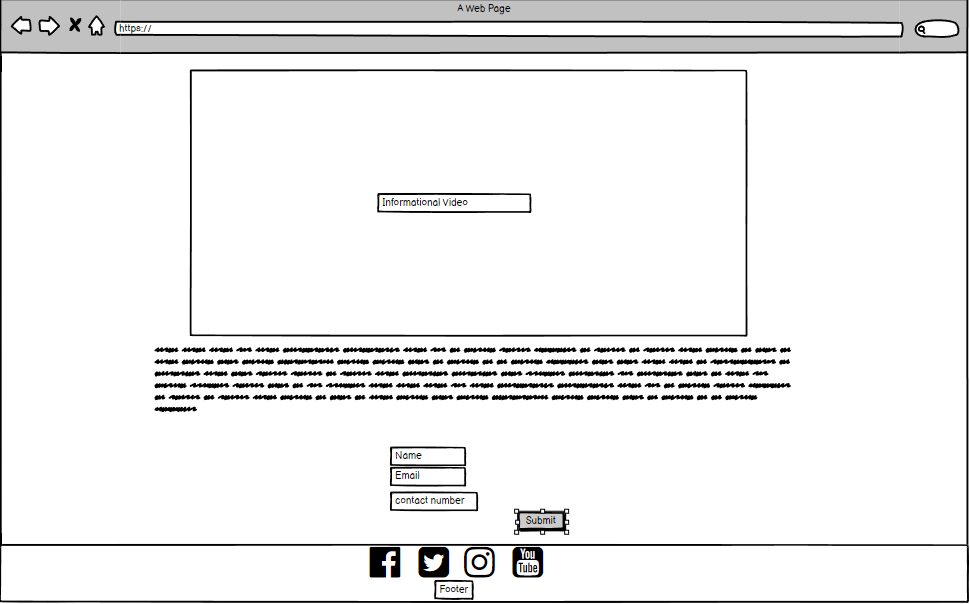
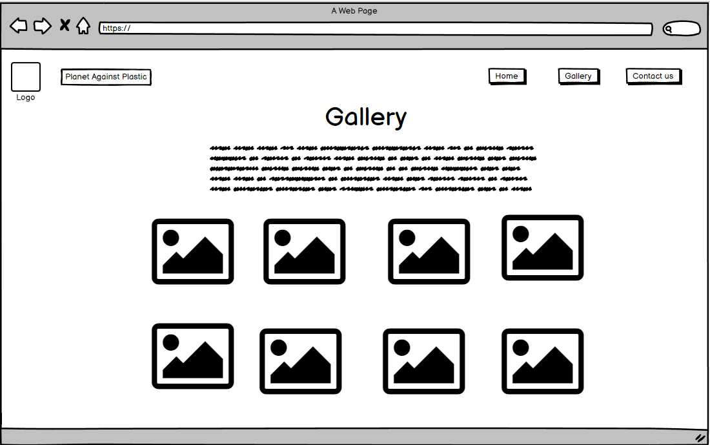

# Planet Against Plastic

## What is Planet Against Plastic?

Planet against plastic is a informational website designed to spread awareness about the increasingly devastating  impact of single use plastics on our environment, 
The aim of the site is to raise concern and teach people some very  simple and easy ways they too can help in the fight
against pollution 

 # Features

 * Functioning navigation bar inluding links too
    * Home
    * Gallery
    * Contact us

* Interactive links

* Responsive design that will work on all screens

* Embedded videos

* Multiple pages

Each of the above links will take you too the corrisponding part of the webpage, making any information you are looking for easily accessible.

#  User Experience (UX)

* Design
    * The colour scheme of this website is very simple but has its meaning, the colors i have chosen are recognized to represent wildlife globally.

    * The font style I have chosen to run throughout the webpage is 'koisei tokumin' as i find it very easy to read while still being appealing for users.

    * The image I have used throughout this website is meant to be shocking to appeal to the users sympathetic side and really get them to realise the change that is needed to be made. It also grabs the user attention and makes them more likely to return to and remember the website.

    * While designing this website I used balsamiq wireframe's to help me build the idea of what i wanted the end design to look like here are some examples of the wireframes i created.

            

    

            

* Technologies used
    * CSS
    * HTML5

    * Balsamiq Wireframe - Used for draft designs on the page.

    * Font Awesome - Used for the website logo and the social media icons.

    * Google Fonts - used to import the 'koisei tokumin' which was used throughout the website.

    * Git - Used the gitpod terminal to create and push the code to github.

    * Github - Used to store all the projects code so website can be published after code is pushed from git.
    