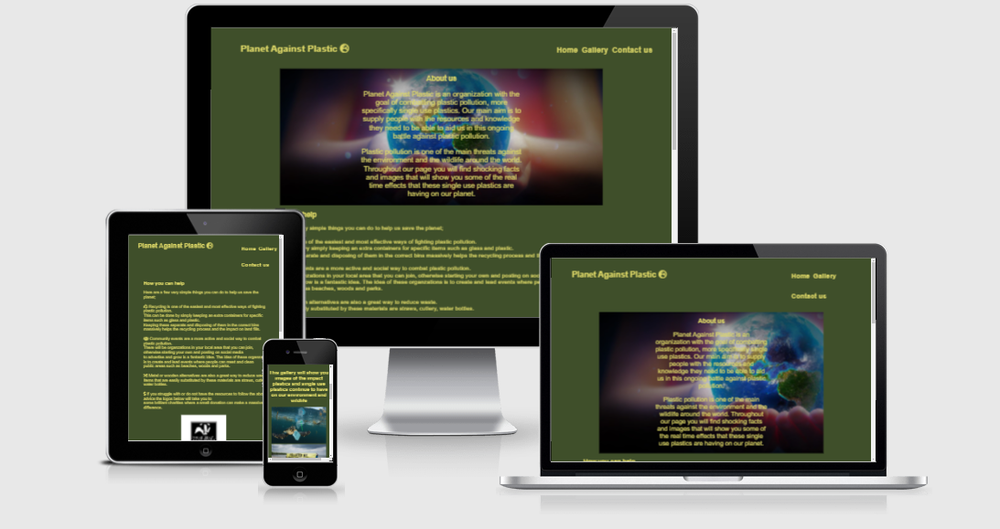

# Planet Against Plastic

## What is Planet Against Plastic?

Planet against plastic is a informational website designed to spread awareness about the increasingly devastating  impact of single use plastics on our environment, 
The aim of the site is to raise concern and teach people some very  simple and easy ways they too can help in the fight
against pollution 

 # Features

 * Functioning navigation bar inluding links too
    * Home
    * Gallery
    * Contact us

* Interactive links

* Responsive design that will work on all screens

* Embedded videos

* Multiple pages

Each of the above links will take you too the corrisponding part of the webpage, making any information you are looking for easily accessible.

#  User Experience (UX)

* Design
    * The colour scheme of this website is very simple but has its meaning, the colors i have chosen are recognized to represent wildlife globally.

    * The font style I have chosen to run throughout the webpage is 'koisei tokumin' as i find it very easy to read while still being appealing for users.

    * The image I have used throughout this website is meant to be shocking to appeal to the users sympathetic side and really get them to realise the change that is needed to be made. It also grabs the user attention and makes them more likely to return to and remember the website.

    * While designing this website I used balsamiq wireframe's to help me build the idea of what i wanted the end design to look like here are some examples of the wireframes i created.

            

    

            

* Technologies used
    * CSS
    * HTML5

    * Balsamiq Wireframe - Used for draft designs on the page.

    * Font Awesome - Used for the website logo and the social media icons.

    * Google Fonts - used to import the 'koisei tokumin' which was used throughout the website.

    * Git - Used the gitpod terminal to create and push the code to github.

    * Github - Used to store all the projects code so website can be published after code is pushed from git.

* User Stories

    * Visitor Goals

        * First Visit

            As a first time visitor, I want to be able to easily navigate the webpage.

            As a first time visitor, I want to understand the motive of the webpage right away and be entrigued to learn more.

        * Returning Visit

            As a returning visitor, I want to be able to explore further through social media links.

            As a returning visitor, I want to be able to contact the organisation for more information on this subject.

            As a returning visitor, I want to find out what else i can do to help and where i can visit to do it.

        * Frequent Visitor

            As a frequent visitor, I want to be able to return and see how the organisation has helped since my last visit.

            As a frequent visitor, I want to return and see if there is any updated videos or information.

* Testing

    * Throughout creating this website i consistently checked my code by using the W3C validators.

    

    * I also used lighthouse to see how efficiently my webpage was running

    

* Testing user stories from user experience (UX)

    * First Time Visitor Goals
        As a first time visitor, I want to be able to easily navigate the webpage.

            When first entering the website the navigation bar is very clear and very easy to use. clicking each of the navigation buttons will take you to the
            part of the site you are looking for

        As a first time visitor, I want to understand the motive of the webpage right away and be entrigued to learn more.

            One of the first things you see when you open the webpage is the about us section which clearly describes what the website is focused on

    * Returning Visitor
        As a returning visitor, I want to be able to explore further through social media links.

            The social media links are very easy to find once you navigate to the contact us section. this allows users to gain more information and trust 
            about the website.

        As a returning visitor, I want to be able to contact the organisation for more information on this subject.

            Upon clicking the contact us navigation you are taken to a simple and easy to use form which will give the organisation your contact details
            and let them know that you are wanting more information about the project.

        As a returning visitor, I want to find out what else i can do to help and where i can visit to do it.

            As a returning visitor you can check to see what charities are linked with planet against project and how i can help.

        

        

        

        

            

    